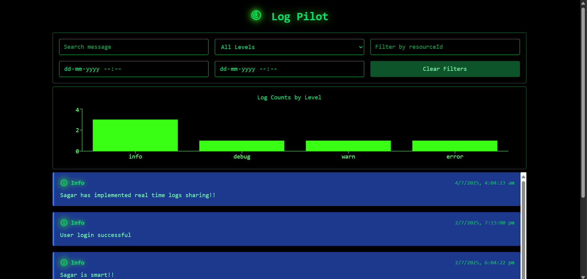
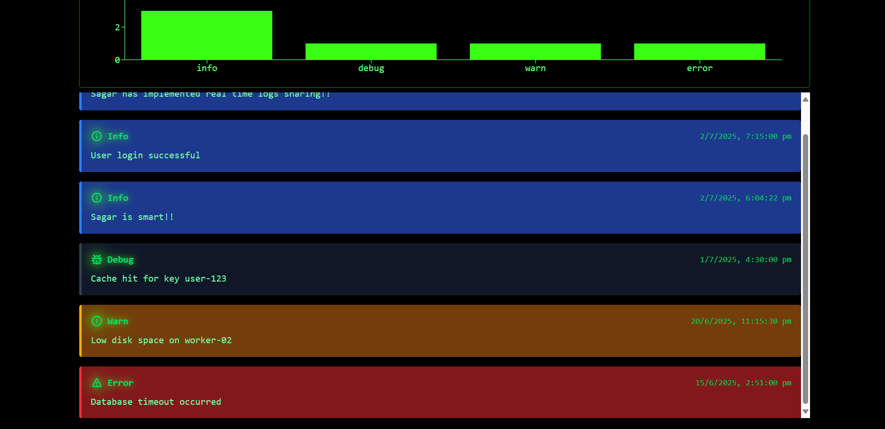
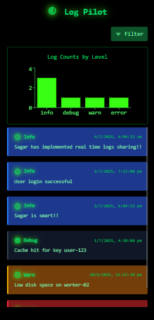
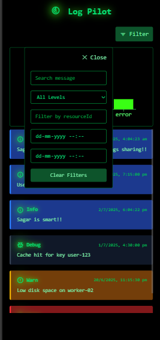

# Log Pilot
you’re in control of your logs

**Log Pilot** is a full-stack logging platform built with **React** and **Node.js** that allows ingestion, querying, and real-time monitoring of log data. Logs are stored in a **local JSON file**, and the application provides a responsive, filterable UI for developers.

---
## Screenshots



  
|  |  | 
|----------------------------------|---------------------------------|
---
## 🚀 Overview

This project simulates a real-world developer tool for inspecting logs. It features:

* 🔁 Real-time updates using **Socket.IO**
* 🧠 In-memory filtering with support for multiple combined criteria
* 📉 A **chart view** showing log level distribution
* 🎨 Clean, dark-themed UI using **Tailwind CSS**
* 🧪 Debounced full-text search on log messages

---

## 📂 Folder Structure

```bash
log-pilot/
├── client/                # React frontend
│   ├── public/
│   └── src/
│       ├── Components/    # React components (LogViewer, LogCard, Chart)
│       ├── hooks/         # Custom hook (useDebounce)
│       ├── App.jsx
│       └── main.jsx
├── server/                # Node.js backend
│   ├── data/              # logs.json for file-based persistence
│   ├── src/
│   │   ├── controllers/   # logsController.js – handles incoming API logic
│   │   ├── routes/        # logsRoutes.js – defines API endpoints
│   │   ├── services/      # logService.js (read/write/filter), socketService.js
│   │   └── utils/         # validateLog.js – schema validation
│   └── index.js           # Entry point, sets up Express and WebSocket server
├── .gitignore
└── README.md
```

> The backend follows a clean **MVC-style pattern** using `routes → controllers → services`, improving modularity and scalability.

---

## 🛠️ Setup Instructions

1. **Clone the Repository**

   ```bash
   git clone <your-repo-url>
   cd log-pilot
   ```

2. **Start Backend**

   ```bash
   cd server
   npm install
   node index.js
   ```

   Runs at: `http://localhost:3001/`

3. **Start Frontend**

   ```bash
   cd client
   npm install
   npm run dev
   ```

   Runs at: `http://localhost:5173/`

> 🔧 No `.env` file required; API URLs are hardcoded.

---

## ⚙️ Key Features

### ✅ Filtering & Search

You can:

* Filter logs by **level**, **resourceId**, and **timestamp range**
* Search messages via **case-insensitive full-text search**
* Combine multiple filters (e.g., `level=error`, `message=db`, `timestamp`, etc.)

**Filtering Logic (Explanation):**
All logs are first loaded and sorted in **reverse-chronological order**. Then, filters are applied one by one based on query parameters. These include log level, message (full-text search), resourceId, traceId, commit, and time range.

### 📊 Log Level Chart

Uses **Recharts** to render a dynamic bar chart showing the count of logs by level (info, error, warn, etc.).

### 🔄 Real-Time Log Streaming

When a new log is ingested via the API, it's immediately pushed to the frontend using **Socket.IO** for a live update experience.

### 🔁 Debounced Input

The message search input uses a **custom debounce hook** to avoid sending API requests on every keystroke.

---

## 🧠 Design Decisions

### Backend

* **File-based persistence** via `fs.promises` with a custom **lock mechanism** to prevent race conditions during concurrent writes.
* Follows **MVC** separation using:

  * `routes` for endpoint definitions
  * `controllers` for request handling
  * `services` for file and socket logic
* Log schema validation is done before ingestion.

### Frontend

* **React + Tailwind CSS** for clean UI
* **Axios** for API calls
* Component-level state with `useState` (no global state needed)
* Real-time updates handled via `useEffect` and Socket.IO

---

## ⚖️ Trade-offs Considered

* **No DB used** as per constraints. Custom file locking ensures consistency.
* Chose **Socket.IO** over polling to reduce server load and provide a smoother real-time experience.
* **Component-level state** over Redux due to small app size.
* **Debounced search** implemented client-side for performance.

---

## 📌 Assumptions

* Logs are ingested manually via **CLI** (e.g., `curl`) or tools like **Postman**
* No authentication required
* Both frontend and backend run locally on fixed ports

---

## 🌟 Bonus Features Implemented

* ✅ Real-time log updates using **Socket.IO**
* ✅ **Debounced full-text search**
* ✅ **Analytics chart** (log counts by level)

---

## 📎 API Reference

### POST `/logs`

Ingest a single log entry.

**Body Example:**

```json
{
  "level": "error",
  "message": "Database connection failed",
  "resourceId": "server-1234",
  "timestamp": "2023-09-15T08:00:00Z",
  "traceId": "abc-xyz-123",
  "spanId": "span-456",
  "commit": "5e5342f",
  "metadata": { "parentResourceId": "server-5678" }
}
```

Returns: `201 Created` and the saved log object.

### GET `/logs`

Query logs using the following optional filters:

* `level` (string)
* `message` (string, full-text)
* `resourceId` (string)
* `timestamp_start`, `timestamp_end` (ISO strings)
* `traceId`, `spanId`, `commit` (string)

Returns: Array of logs sorted newest first.

---

**Sagar Dubey** 📧 [sagardubey353@gmail.com](mailto:sagardubey353@gmail.com)